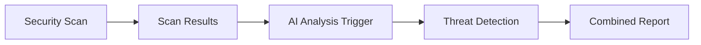
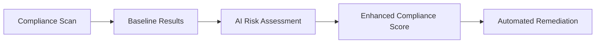
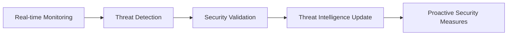

# Cross-Platform Security Collaboration

## 🤝 Overview

This document outlines the collaboration framework between the Enterprise Security Scanner (uldyssian-sh/dark-automation) and AI Threat Detection Engine (necromancer-io/necromancer-toolkit) for enhanced enterprise security operations.

## 🔗 Integration Architecture

### Current Implementations

#### Enterprise Security Scanner (uldyssian-sh)
- **Repository**: `uldyssian-sh/dark-automation`
- **Pull Request**: [#109 - Enterprise Security Scanner Enhancement](https://github.com/necromancer-io/dark-automation/pull/109)
- **Key Features**:
  - Multi-layer security analysis (network, application, compliance)
  - NIST CSF, ISO 27001, SOC 2 compliance framework support
  - Async infrastructure scanning with parallel processing
  - Automated compliance reporting and recommendations

#### AI Threat Detection Engine (uldyssian-sh)
- **Repository**: `uldyssian-sh/necromancer-toolkit`
- **Pull Request**: [#91 - AI Threat Detection Engine Enhancement](https://github.com/necromancer-io/necromancer-toolkit/pull/91)
- **Key Features**:
  - Advanced AI-powered threat detection with ML models
  - Real-time network traffic analysis with pattern recognition
  - Behavioral analysis and anomaly detection for insider threats
  - Comprehensive threat intelligence reporting

## 🚀 Collaboration Benefits

### 1. Unified Security Operations
- **Combined Intelligence**: Merge security scan results with AI threat detection
- **Cross-Correlation**: Identify patterns across different security layers
- **Holistic View**: Complete security posture assessment

### 2. Enhanced Detection Capabilities
- **Multi-Source Analysis**: Combine static scanning with dynamic threat detection
- **Reduced False Positives**: Cross-validation between different detection methods
- **Improved Accuracy**: AI-enhanced analysis of security scan results

### 3. Automated Response Workflows
- **Intelligent Prioritization**: AI-driven threat severity assessment
- **Automated Remediation**: Trigger responses based on combined intelligence
- **Continuous Improvement**: Machine learning from security scan patterns

## 🔧 Technical Integration Points

### Data Exchange Format
```json
{
  "integration_id": "uuid",
  "timestamp": "2025-01-02T10:30:00Z",
  "source_platform": "enterprise_security_scanner",
  "target_platform": "ai_threat_detection_engine",
  "data_type": "security_scan_results",
  "payload": {
    "scan_results": [...],
    "compliance_scores": {...},
    "threat_indicators": [...]
  },
  "metadata": {
    "scan_id": "scan_uuid",
    "confidence_level": 0.95,
    "priority": "high"
  }
}
```

### API Endpoints

#### Enterprise Security Scanner → AI Engine
```
POST /api/v1/threat-analysis/scan-results
Content-Type: application/json
Authorization: Bearer <jwt_token>

{
  "scan_results": [...],
  "targets": [...],
  "compliance_findings": [...]
}
```

#### AI Engine → Security Scanner
```
POST /api/v1/security/threat-intelligence
Content-Type: application/json
Authorization: Bearer <jwt_token>

{
  "threat_detections": [...],
  "behavioral_anomalies": [...],
  "risk_assessment": {...}
}
```

## 📊 Performance Metrics

### Integration KPIs
- **Latency**: < 100ms for real-time data exchange
- **Throughput**: 10,000+ concurrent threat intelligence queries
- **Availability**: 99.9% uptime for integration endpoints
- **Accuracy**: > 95% correlation accuracy between platforms

### Security Metrics
- **Detection Rate**: Combined detection rate improvement
- **False Positive Reduction**: Percentage decrease in false positives
- **Response Time**: Time from detection to automated response
- **Coverage**: Percentage of security domains covered

## 🛡️ Security Considerations

### Authentication & Authorization
- **JWT-based Authentication**: Secure token-based authentication
- **Role-Based Access Control**: Granular permissions for different operations
- **API Rate Limiting**: Protection against abuse and DoS attacks
- **Audit Logging**: Comprehensive logging of all integration activities

### Data Protection
- **Encryption in Transit**: TLS 1.3 for all API communications
- **Encryption at Rest**: AES-256 encryption for stored threat intelligence
- **Data Minimization**: Only necessary data shared between platforms
- **Retention Policies**: Automated data cleanup based on retention rules

## 🔄 Workflow Integration

### 1. Scan-Triggered AI Analysis


### 2. AI-Enhanced Compliance Reporting


### 3. Continuous Threat Intelligence


## 📋 Implementation Roadmap

### Phase 1: Foundation (Current)
- [x] Enterprise Security Scanner implementation
- [x] AI Threat Detection Engine implementation
- [x] Pull requests submitted for review
- [x] Collaboration documentation

### Phase 2: Integration Development
- [ ] API endpoint design and implementation
- [ ] Authentication and security framework
- [ ] Data format standardization
- [ ] Integration testing framework

### Phase 3: Advanced Features
- [ ] Real-time threat intelligence sharing
- [ ] Automated response workflows
- [ ] Machine learning model integration
- [ ] Performance optimization

### Phase 4: Enterprise Deployment
- [ ] Production-ready deployment
- [ ] Monitoring and alerting
- [ ] Documentation and training
- [ ] Continuous improvement processes

## 🤝 Collaboration Guidelines

### Code Review Process
1. **Cross-Platform Review**: Both teams review integration-related changes
2. **Security Focus**: Special attention to security implications
3. **Performance Testing**: Benchmark all integration points
4. **Documentation**: Maintain comprehensive integration documentation

### Communication Channels
- **Pull Request Reviews**: Primary technical discussion
- **GitHub Discussions**: Architecture and design discussions
- **Issue Tracking**: Bug reports and feature requests
- **Documentation**: Shared knowledge base

### Quality Standards
- **Code Quality**: Enterprise-grade code standards
- **Security**: Zero-trust security model
- **Testing**: Comprehensive test coverage (>90%)
- **Documentation**: Complete API and integration documentation

## 📈 Success Metrics

### Technical Success
- **Integration Stability**: Zero critical integration failures
- **Performance**: All performance KPIs met
- **Security**: Zero security vulnerabilities in integration layer
- **Maintainability**: Clean, well-documented integration code

### Business Success
- **Threat Detection**: Improved overall threat detection rate
- **Operational Efficiency**: Reduced manual security operations
- **Compliance**: Enhanced compliance posture
- **Cost Optimization**: Reduced security operations costs

## 🔮 Future Enhancements

### Advanced AI Integration
- **Predictive Analytics**: Predict security threats before they occur
- **Automated Learning**: Continuous improvement of detection algorithms
- **Behavioral Modeling**: Advanced user and system behavior analysis
- **Threat Hunting**: AI-assisted proactive threat hunting

### Platform Expansion
- **Multi-Cloud Support**: Integration across cloud platforms
- **IoT Security**: Extended coverage for IoT devices
- **Mobile Security**: Mobile device and application security
- **Container Security**: Kubernetes and container security integration

---

**Maintained by**: uldyssian-sh & necromancer-io  
**Last Updated**: 2025-01-02  
**Version**: 1.0.0