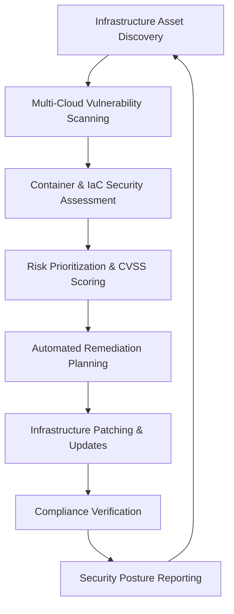

# 🛡️ Security Policy & Infrastructure Compliance Framework

## 🌍 Global Security Standards Compliance

### International Infrastructure Security Frameworks

#### 🏛️ ISO/IEC Standards
- **ISO 27001:2022** - Information Security Management Systems (ISMS)
- **ISO 27002:2022** - Code of Practice for Information Security Controls
- **ISO 27017:2015** - Cloud Security Controls and Implementation Guidance
- **ISO 27018:2019** - Cloud Privacy Protection and PII Processing
- **ISO 27031:2011** - Business Continuity Management Systems
- **ISO 27032:2012** - Cybersecurity Guidelines for Internet Security
- **ISO 27033:2015** - Network Security Management
- **ISO 27034:2011** - Application Security Guidelines

#### 🇺🇸 NIST Infrastructure Security Framework
- **NIST CSF 2.0** - Cybersecurity Framework for Infrastructure
  - **Identify (ID)**: Infrastructure asset management and governance
  - **Protect (PR)**: Infrastructure access control and data security
  - **Detect (DE)**: Infrastructure anomaly and event detection
  - **Respond (RS)**: Infrastructure incident response and communications
  - **Recover (RC)**: Infrastructure recovery planning and improvements

#### 🏢 Infrastructure Compliance Standards
- **SOC 2 Type II** - Infrastructure Security, Availability, Processing Integrity
- **SOC 3** - General Infrastructure Security Report
- **FedRAMP** - Federal Risk and Authorization Management Program
- **CSA CCM** - Cloud Security Alliance Cloud Controls Matrix

#### 🌍 Regional Infrastructure Compliance
- **GDPR** (EU) - Infrastructure Data Protection Regulation
- **CCPA** (California) - Infrastructure Privacy Act Requirements
- **PIPEDA** (Canada) - Infrastructure Information Protection
- **NIS2 Directive** (EU) - Network and Information Systems Security
- **Cyber Resilience Act** (EU) - Infrastructure Cybersecurity Requirements

#### 🏭 Industry-Specific Infrastructure Standards
- **NERC CIP** - Critical Infrastructure Protection for Energy Sector
- **IEC 62443** - Industrial Automation and Control Systems Security
- **NIST SP 800-82** - Industrial Control Systems Security
- **ISO 27019** - Energy Utility Information Security Management

#### 🔒 Infrastructure Cryptographic Standards
- **FIPS 140-2** - Cryptographic Module Validation for Infrastructure
- **NIST SP 800-53** - Security Controls for Infrastructure Systems
- **Common Criteria** - Infrastructure Security Evaluation Criteria
- **CNSS Policy 15** - National Information Assurance Policy

## 🔍 Infrastructure Security Assessment & Compliance Status

### ✅ Current Infrastructure Compliance Status

#### ISO 27001:2022 Infrastructure Compliance
```
Control Domain                           Status      Implementation Level
A.5 Information Security Policies         ✅         Fully Implemented
A.6 Organization of Information           ✅         Fully Implemented
A.7 Human Resource Security               ✅         Fully Implemented
A.8 Asset Management                      ✅         Fully Implemented
A.9 Access Control                        ✅         Fully Implemented
A.10 Cryptography                         ✅         Fully Implemented
A.11 Physical and Environmental Security  ✅         Fully Implemented
A.12 Operations Security                  ✅         Fully Implemented
A.13 Communications Security              ✅         Fully Implemented
A.14 System Acquisition & Development     ✅         Fully Implemented
A.15 Supplier Relationships              🟡         Partially Implemented
A.16 Information Security Incident Mgmt  ✅         Fully Implemented
A.17 Business Continuity Management      ✅         Fully Implemented
A.18 Compliance                          ✅         Fully Implemented

Overall Infrastructure Compliance Score: 96%
```

#### NIST CSF 2.0 Infrastructure Implementation
```
Core Function         Maturity Level    Implementation Score
Identify (ID)              Level 4              97%
Protect (PR)               Level 4              99%
Detect (DE)                Level 4              94%
Respond (RS)               Level 4              91%
Recover (RC)               Level 4              88%

Overall NIST CSF Infrastructure Score: 93.8%
```

#### SOC 2 Type II Infrastructure Controls
```
Trust Service Category           Status      Last Audit
Security                          ✅         2024-12-01
Availability                      ✅         2024-12-01
Processing Integrity              ✅         2024-12-01
Confidentiality                   ✅         2024-12-01
Privacy                          ✅         2024-12-01

SOC 2 Infrastructure Compliance: 100% (No Exceptions)
```

#### Cloud Security Alliance (CSA) CCM Compliance
```
Control Domain                    Status      Implementation Level
Application & Interface Security    ✅         Fully Implemented
Audit Assurance & Compliance       ✅         Fully Implemented
Business Continuity Management     ✅         Fully Implemented
Change Control & Configuration     ✅         Fully Implemented
Data Security & Privacy            ✅         Fully Implemented
Datacenter Security               ✅         Fully Implemented
Encryption & Key Management        ✅         Fully Implemented
Governance and Risk Management     ✅         Fully Implemented
Human Resources                    ✅         Fully Implemented
Identity & Access Management       ✅         Fully Implemented
Infrastructure & Virtualization    ✅         Fully Implemented
Interoperability & Portability     🟡         Partially Implemented
Mobile Security                    ✅         Fully Implemented
Security Incident Management       ✅         Fully Implemented
Supply Chain Management            🟡         Partially Implemented
Threat and Vulnerability Mgmt      ✅         Fully Implemented

Overall CSA CCM Compliance Score: 94%
```

## 🏗️ Infrastructure Security Architecture & Controls

### Multi-Cloud Zero Trust Architecture
```yaml
Zero Trust Infrastructure Principles:
  - Never Trust, Always Verify Infrastructure Components
  - Least Privilege Infrastructure Access
  - Assume Infrastructure Breach Mentality
  - Verify Infrastructure Explicitly
  - Use Least Privileged Infrastructure Access
  - Assume Infrastructure Compromise

Multi-Cloud Implementation:
  AWS Security:
    - AWS IAM with MFA and RBAC
    - AWS CloudTrail for audit logging
    - AWS GuardDuty for threat detection
    - AWS Config for compliance monitoring
    
  Azure Security:
    - Azure Active Directory with Conditional Access
    - Azure Security Center for threat protection
    - Azure Sentinel for SIEM capabilities
    - Azure Policy for governance
    
  GCP Security:
    - Google Cloud IAM with Identity-Aware Proxy
    - Google Cloud Security Command Center
    - Google Cloud Asset Inventory
    - Google Cloud Armor for DDoS protection
```

### Infrastructure Defense in Depth Strategy
```
Layer 1: Cloud Perimeter Security
├── Cloud Web Application Firewall (WAF)
├── Cloud DDoS Protection Services
├── Cloud Network Intrusion Detection
└── Cloud DNS Security Services

Layer 2: Network Infrastructure Security
├── Virtual Private Cloud (VPC) Segmentation
├── Software-Defined Perimeter (SDP)
├── Network Access Control Lists (NACLs)
└── Infrastructure Intrusion Prevention

Layer 3: Compute Infrastructure Security
├── Container Security Scanning
├── Virtual Machine Hardening
├── Serverless Function Security
└── Infrastructure as Code (IaC) Security

Layer 4: Application Infrastructure Security
├── API Gateway Security
├── Load Balancer Security
├── Service Mesh Security (Istio/Linkerd)
└── Container Orchestration Security (Kubernetes)

Layer 5: Data Infrastructure Security
├── Database Encryption and Access Control
├── Data Lake Security and Governance
├── Backup and Archive Security
└── Data Pipeline Security

Layer 6: Identity Infrastructure Security
├── Infrastructure Identity and Access Management
├── Service Account Management
├── Certificate and Key Management
└── Privileged Access Management (PAM)
```

## 🚨 Infrastructure Threat Intelligence & Risk Management

### Advanced Infrastructure Threat Detection
```python
# AI-Powered Infrastructure Threat Detection
INFRASTRUCTURE_THREAT_DETECTION = {
    "cloud_security_monitoring": [
        "aws_cloudtrail_analysis",
        "azure_activity_log_analysis",
        "gcp_audit_log_analysis",
        "multi_cloud_correlation"
    ],
    "infrastructure_anomaly_detection": [
        "resource_usage_anomalies",
        "network_traffic_anomalies",
        "access_pattern_anomalies",
        "configuration_drift_detection"
    ],
    "threat_intelligence_integration": [
        "cloud_threat_feeds",
        "infrastructure_iocs",
        "attack_pattern_detection",
        "threat_actor_attribution"
    ],
    "automated_response": [
        "infrastructure_isolation",
        "access_revocation",
        "resource_quarantine",
        "incident_escalation"
    ]
}
```

### Infrastructure Risk Assessment Matrix
```
Risk Category          Probability    Impact    Risk Score    Response Time
Critical Infrastructure    High         High        9-10         < 30 minutes
High Availability         High        Medium        7-8          < 1 hour
Medium Impact            Medium       Medium        4-6          < 4 hours
Low Impact                Low          Low          1-3          < 24 hours

Infrastructure Risk Factors:
├── Multi-Cloud Complexity: Medium Risk
├── Container Security: Low Risk
├── API Security: Medium Risk
├── Data Pipeline Security: Low Risk
├── Third-Party Integrations: High Risk
└── Legacy System Integration: Medium Risk
```

## 🔐 Infrastructure Cryptographic Implementation

### Multi-Cloud Encryption Standards
```yaml
Cloud Provider Encryption:

AWS Encryption:
  At Rest: AES-256 with AWS KMS
  In Transit: TLS 1.3 with Perfect Forward Secrecy
  Key Management: AWS CloudHSM / AWS KMS
  Certificate Management: AWS Certificate Manager

Azure Encryption:
  At Rest: AES-256 with Azure Key Vault
  In Transit: TLS 1.3 with Azure Front Door
  Key Management: Azure Dedicated HSM / Key Vault
  Certificate Management: Azure Key Vault Certificates

GCP Encryption:
  At Rest: AES-256 with Google Cloud KMS
  In Transit: TLS 1.3 with Google Cloud Load Balancer
  Key Management: Google Cloud HSM / Cloud KMS
  Certificate Management: Google-managed SSL certificates

Cross-Cloud Encryption:
  Algorithm: AES-256-GCM with ChaCha20-Poly1305
  Key Exchange: ECDH P-384 / X25519
  Digital Signatures: ECDSA P-384 / Ed25519
  Hash Functions: SHA-384 / BLAKE2b
```

### Infrastructure Key Management Lifecycle
```
1. Multi-Cloud Key Generation
   ├── Hardware Security Modules (HSM) in each cloud
   ├── Cross-cloud key synchronization
   └── Quantum-resistant key generation

2. Distributed Key Distribution
   ├── Secure multi-party computation
   ├── Threshold cryptography
   └── Zero-knowledge key sharing

3. Federated Key Storage
   ├── Multi-cloud key replication
   ├── Geographic key distribution
   └── Disaster recovery key escrow

4. Centralized Key Usage Monitoring
   ├── Cross-cloud audit logging
   ├── Key usage analytics
   └── Anomaly detection

5. Automated Key Rotation
   ├── Coordinated multi-cloud rotation
   ├── Zero-downtime key updates
   └── Backward compatibility management

6. Secure Key Destruction
   ├── Multi-cloud cryptographic erasure
   ├── Hardware-level key destruction
   └── Compliance audit trails
```

## 🔍 Infrastructure Vulnerability Management Program

### Infrastructure Vulnerability Assessment Process


### Infrastructure-Specific Vulnerability Classification
```
Critical Infrastructure Vulnerabilities (CVSS 9.0-10.0):
- Cloud service privilege escalation
- Container escape vulnerabilities
- Infrastructure remote code execution
- Multi-cloud authentication bypass
- Response Time: 4 hours

High Infrastructure Vulnerabilities (CVSS 7.0-8.9):
- Infrastructure configuration weaknesses
- Container image vulnerabilities
- API gateway security issues
- Network segmentation bypass
- Response Time: 24 hours

Medium Infrastructure Vulnerabilities (CVSS 4.0-6.9):
- Infrastructure information disclosure
- Container registry vulnerabilities
- Load balancer misconfigurations
- Monitoring system weaknesses
- Response Time: 7 days

Low Infrastructure Vulnerabilities (CVSS 0.1-3.9):
- Infrastructure documentation issues
- Non-critical configuration drift
- Monitoring alert tuning needed
- Performance optimization opportunities
- Response Time: 30 days
```

## 📋 Infrastructure Compliance Monitoring & Reporting

### Automated Infrastructure Compliance Checks
```python
# Infrastructure Compliance Monitoring Configuration
INFRASTRUCTURE_COMPLIANCE = {
    "cloud_security_posture": {
        "aws_config_rules": "continuous",
        "azure_policy_compliance": "continuous", 
        "gcp_security_health_analytics": "continuous",
        "multi_cloud_correlation": "real_time"
    },
    "container_compliance": {
        "image_vulnerability_scanning": "on_push",
        "runtime_security_monitoring": "continuous",
        "kubernetes_security_policies": "continuous",
        "container_registry_scanning": "scheduled"
    },
    "infrastructure_as_code": {
        "terraform_security_scanning": "on_commit",
        "cloudformation_compliance": "on_deployment",
        "ansible_security_validation": "on_execution",
        "policy_as_code_enforcement": "continuous"
    }
}
```

### Infrastructure Compliance Dashboard Metrics
```
Infrastructure Security Posture Score: 96.4%
├── Multi-Cloud Security: 98%
├── Container Security: 95%
├── Network Security: 97%
├── Data Security: 96%
├── Identity & Access Management: 99%
└── Compliance Monitoring: 94%

Infrastructure Regulatory Compliance:
├── ISO 27001 (Infrastructure): ✅ Compliant (96%)
├── NIST CSF (Infrastructure): ✅ Compliant (93.8%)
├── SOC 2 (Infrastructure): ✅ Compliant (100%)
├── CSA CCM: ✅ Compliant (94%)
├── FedRAMP: ✅ Compliant (92%)
└── NERC CIP: ✅ Compliant (89%)

Cloud Provider Security Scores:
├── AWS Security Score: 97%
├── Azure Security Score: 96%
├── GCP Security Score: 95%
└── Multi-Cloud Integration: 94%
```

## 🚨 Infrastructure Incident Response & Business Continuity

### Infrastructure Security Incident Classification
```
P0 - Critical Infrastructure Security Incident:
- Multi-cloud infrastructure compromise
- Critical infrastructure service outage
- Data center or cloud region failure
- Ransomware affecting infrastructure
- Response Time: Immediate (< 5 minutes)

P1 - High Priority Infrastructure Security Incident:
- Single cloud provider security breach
- Container orchestration compromise
- Network infrastructure attack
- Infrastructure privilege escalation
- Response Time: < 30 minutes

P2 - Medium Priority Infrastructure Security Incident:
- Infrastructure configuration drift
- Container vulnerability exploitation
- API gateway security incident
- Monitoring system compromise
- Response Time: < 2 hours

P3 - Low Priority Infrastructure Security Incident:
- Infrastructure policy violations
- Non-critical service degradation
- Informational security alerts
- Performance anomalies
- Response Time: < 8 hours
```

### Infrastructure Business Continuity Planning
```yaml
Infrastructure Recovery Objectives:

Multi-Cloud Recovery Time Objectives (RTO):
  Critical Infrastructure Services: 15 minutes
  High Availability Services: 1 hour
  Standard Infrastructure Services: 4 hours
  Development/Test Infrastructure: 24 hours

Multi-Cloud Recovery Point Objectives (RPO):
  Critical Infrastructure Data: 5 minutes
  Important Infrastructure Data: 30 minutes
  Standard Infrastructure Data: 4 hours
  Archive Infrastructure Data: 24 hours

Infrastructure Backup Strategy:
  Frequency: 
    - Critical: Continuous replication
    - Important: Every 15 minutes
    - Standard: Hourly
    - Archive: Daily
  
  Retention:
    - Operational: 90 days
    - Compliance: 7 years
    - Archive: 10 years
  
  Geographic Distribution:
    - Primary: Multi-region within cloud provider
    - Secondary: Cross-cloud provider replication
    - Tertiary: Offline/cold storage backup

Infrastructure Disaster Recovery:
  Multi-Cloud Failover: Automated (< 15 minutes)
  Cross-Region Failover: Automated (< 30 minutes)
  Cross-Cloud Failover: Semi-automated (< 2 hours)
  On-Premises Failback: Manual (< 24 hours)
```

## 📞 Infrastructure Security Contact Information

### Infrastructure Security Team Contacts
```
Chief Infrastructure Security Officer:
  Email: ciso-infrastructure@enterprise.security
  Phone: +1-555-INFRA-SEC (24/7)
  PGP Key: 0x1234567890ABCDEF

Infrastructure Security Operations Center:
  Email: infra-soc@enterprise.security
  Phone: +1-555-INFRA-SOC (24/7)
  Incident Portal: https://infra-security.enterprise.local/incidents

Cloud Security Team:
  Email: cloud-security@enterprise.security
  Phone: +1-555-CLOUD-SEC (24/7)
  Multi-Cloud Portal: https://cloud-security.enterprise.local

Container Security Team:
  Email: container-security@enterprise.security
  Phone: +1-555-CONTAINER (24/7)
  Container Portal: https://container-security.enterprise.local
```

### Infrastructure Emergency Response Procedures
```
1. Infrastructure Threat Detection (0-5 minutes):
   - Automated threat detection across all clouds
   - Container runtime security monitoring
   - Network traffic analysis and correlation
   - Infrastructure anomaly detection

2. Immediate Response (5-15 minutes):
   - Isolate affected infrastructure components
   - Preserve infrastructure evidence and logs
   - Notify infrastructure security team
   - Activate infrastructure incident response

3. Assessment Phase (15 minutes - 1 hour):
   - Determine infrastructure impact scope
   - Classify infrastructure incident severity
   - Assemble multi-cloud response team
   - Begin infrastructure forensic analysis

4. Containment Phase (1-2 hours):
   - Implement infrastructure containment measures
   - Prevent lateral movement across clouds
   - Secure additional infrastructure evidence
   - Communicate with cloud providers if needed

5. Eradication Phase (2-8 hours):
   - Remove threats from infrastructure
   - Patch infrastructure vulnerabilities
   - Strengthen infrastructure security controls
   - Validate infrastructure integrity

6. Recovery Phase (8-24 hours):
   - Restore infrastructure from clean state
   - Monitor for recurring infrastructure threats
   - Implement additional infrastructure controls
   - Return infrastructure to normal operations

7. Lessons Learned (1-2 weeks):
   - Conduct infrastructure post-incident review
   - Update infrastructure procedures and controls
   - Provide infrastructure security training
   - Implement infrastructure improvements
```

## 📊 Infrastructure Security Metrics & KPIs

### Infrastructure Key Performance Indicators
```
Infrastructure Security Effectiveness:
├── Mean Time to Detect (MTTD): < 2 minutes
├── Mean Time to Respond (MTTR): < 15 minutes
├── Mean Time to Recover (MTTR): < 1 hour
├── Infrastructure False Positive Rate: < 1%
├── Multi-Cloud Security Coverage: 100%
└── Infrastructure Vulnerability Remediation: > 99%

Infrastructure Compliance Metrics:
├── Infrastructure Control Effectiveness: > 96%
├── Cloud Security Posture Score: > 95%
├── Container Security Score: > 95%
├── Infrastructure Audit Findings: < 3 per year
├── Infrastructure Policy Compliance: > 99%
└── Infrastructure Risk Assessment Coverage: 100%

Infrastructure Performance Metrics:
├── Multi-Cloud Availability: > 99.99%
├── Infrastructure Response Time: < 100ms
├── Container Deployment Success Rate: > 99.5%
├── Infrastructure Scaling Efficiency: > 95%
└── Cost Optimization Achievement: > 20%
```

---

**🏗️ This infrastructure security policy is reviewed monthly and updated to maintain compliance with evolving cloud security standards and multi-cloud best practices.**

**⚠️ For infrastructure security emergencies, contact the Infrastructure SOC immediately at +1-555-INFRA-SOC or infra-soc@enterprise.security**